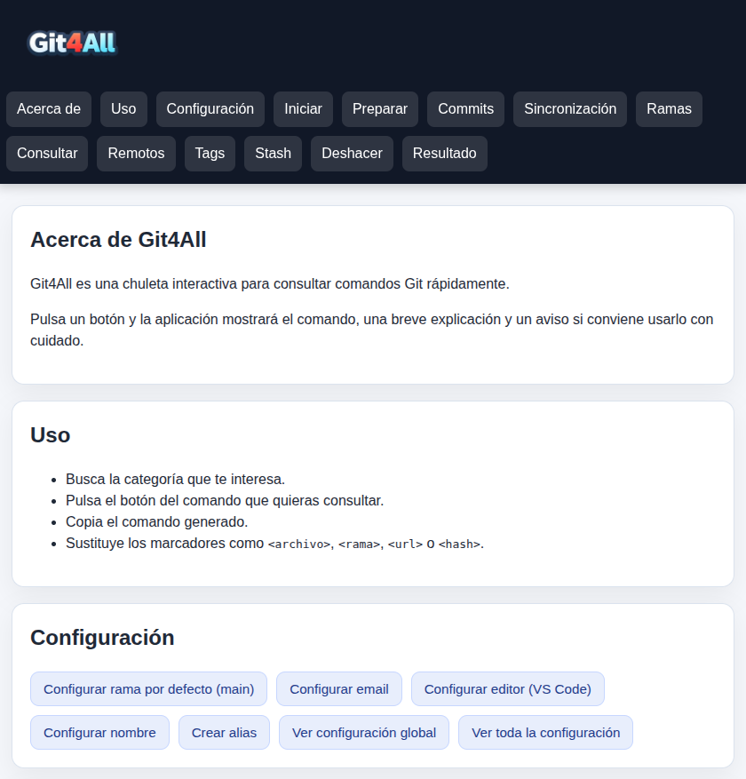

# Git4All

**Git4All** es una guía interactiva de comandos Git pensada para consultar acciones comunes sin perder tiempo buscando sintaxis. Seleccionas una acción, obtienes el comando listo para copiar, una explicación breve y avisos de uso cuando hay riesgo.

Ideal para estudiantes, perfiles junior y cualquier persona que quiera tener a mano una referencia visual y práctica de Git.

🔗 **Demo principal:** https://git4all.vercel.app/  
🔗 **Mirror en GitHub Pages:** https://cloudxdam.github.io/git4all/

## Vista previa



---

## ¿Qué incluye?

Más de 80 comandos organizados en 11 categorías:

- **Commits** — crear, modificar, revertir y aplicar commits
- **Configuración** — usuario, email, editor, alias y ramas por defecto
- **Consultar** — estado, historial, diffs, blame, reflog y más
- **Deshacer** — restore, reset y clean con distintos niveles de impacto
- **Iniciar** — crear o clonar repositorios y conectarlos al remoto
- **Preparar** — staging interactivo y por archivo
- **Ramas** — crear, cambiar, fusionar, rebasar, subir y borrar ramas
- **Remotos** — gestión completa de remotos
- **Sincronización** — push, pull y fetch con sus variantes
- **Stash** — guardar, listar, aplicar y borrar stashes
- **Tags** — crear, subir y borrar etiquetas

## ¿Por qué este proyecto?

Aprender Git suele implicar recordar comandos, opciones y diferencias entre acciones parecidas como `reset`, `restore`, `revert` o `checkout`. Este proyecto busca hacerlo más accesible con una interfaz rápida, visual y centrada en tareas reales.

## Uso

1. Abre `index.html` en tu navegador. Si quieres una compatibilidad más consistente, se recomienda usar un servidor local.
2. Navega a la categoría que necesites.
3. Pulsa el botón del comando.
4. Copia el snippet generado y sustituye los marcadores (`<archivo>`, `<rama>`, `<hash>`, etc.).

Si quieres levantarlo desde un servidor local, ejecuta este comando en la carpeta del proyecto:
```bash
python3 -m http.server 8000
```
Luego abre `http://localhost:8000` en tu navegador.

## Estructura del proyecto

```
Git4All/
├── index.html      # Estructura y contenido
├── styles.css      # Estilos
├── app.js          # Lógica de interacción
└── img/
    └── logo.png
```

## Tecnologías

HTML, CSS y JavaScript vanilla. Sin dependencias ni frameworks.

## Objetivo

Ofrecer una herramienta ligera, fácil de abrir y de entender, que sirva tanto como apoyo de estudio como referencia rápida en el día a día.

## Contribuir

Las contribuciones son bienvenidas. Si echas en falta algún comando o ves algún error:

1. Haz un fork del repositorio.
2. Crea una rama: `git checkout -b mejora/nombre-del-cambio`
3. Haz commit de tus cambios: `git commit -m "Añadir comando X"`
4. Abre un Pull Request.

## Licencia

MIT © 2026 PacheDev (Daniel Pacheco - cloudxdam@gmail.com)
